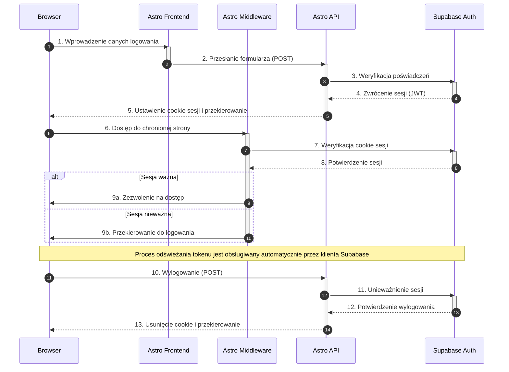

<mermaid_diagram>

```mermaid
sequenceDiagram
    autonumber

    participant Browser
    participant Astro Frontend
    participant Astro Middleware
    participant Astro API
    participant Supabase Auth

    Browser->>Astro Frontend: 1. Wprowadzenie danych logowania
    activate Astro Frontend
    Astro Frontend->>Astro API: 2. Przesłanie formularza (POST)
    deactivate Astro Frontend

    activate Astro API
    Astro API->>Supabase Auth: 3. Weryfikacja poświadczeń
    activate Supabase Auth
    Supabase Auth-->>Astro API: 4. Zwrócenie sesji (JWT)
    deactivate Supabase Auth
    Astro API-->>Browser: 5. Ustawienie cookie sesji i przekierowanie
    deactivate Astro API

    Browser->>Astro Middleware: 6. Dostęp do chronionej strony
    activate Astro Middleware
    Astro Middleware->>Supabase Auth: 7. Weryfikacja cookie sesji
    activate Supabase Auth
    Supabase Auth-->>Astro Middleware: 8. Potwierdzenie sesji
    deactivate Supabase Auth

    alt Sesja ważna
        Astro Middleware->>Browser: 9a. Zezwolenie na dostęp
    else Sesja nieważna
        Astro Middleware->>Browser: 9b. Przekierowanie do logowania
    end
    deactivate Astro Middleware

    Note over Browser, Supabase Auth: Proces odświeżania tokenu jest obsługiwany automatycznie przez klienta Supabase

    Browser->>Astro API: 10. Wylogowanie (POST)
    activate Astro API
    Astro API->>Supabase Auth: 11. Unieważnienie sesji
    activate Supabase Auth
    Supabase Auth-->>Astro API: 12. Potwierdzenie wylogowania
    deactivate Supabase Auth
    Astro API-->>Browser: 13. Usunięcie cookie i przekierowanie
    deactivate Astro API
```

</mermaid_diagram>
